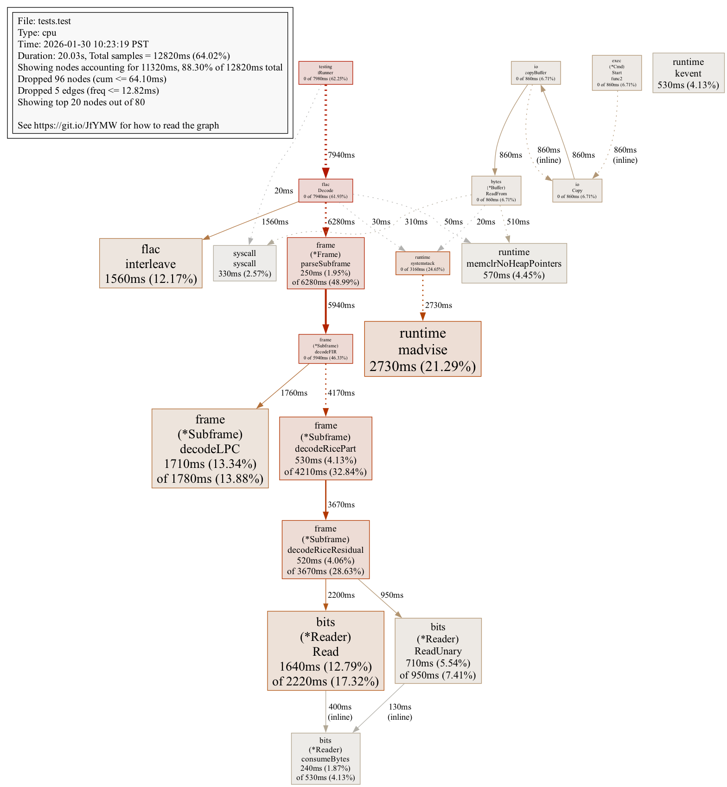
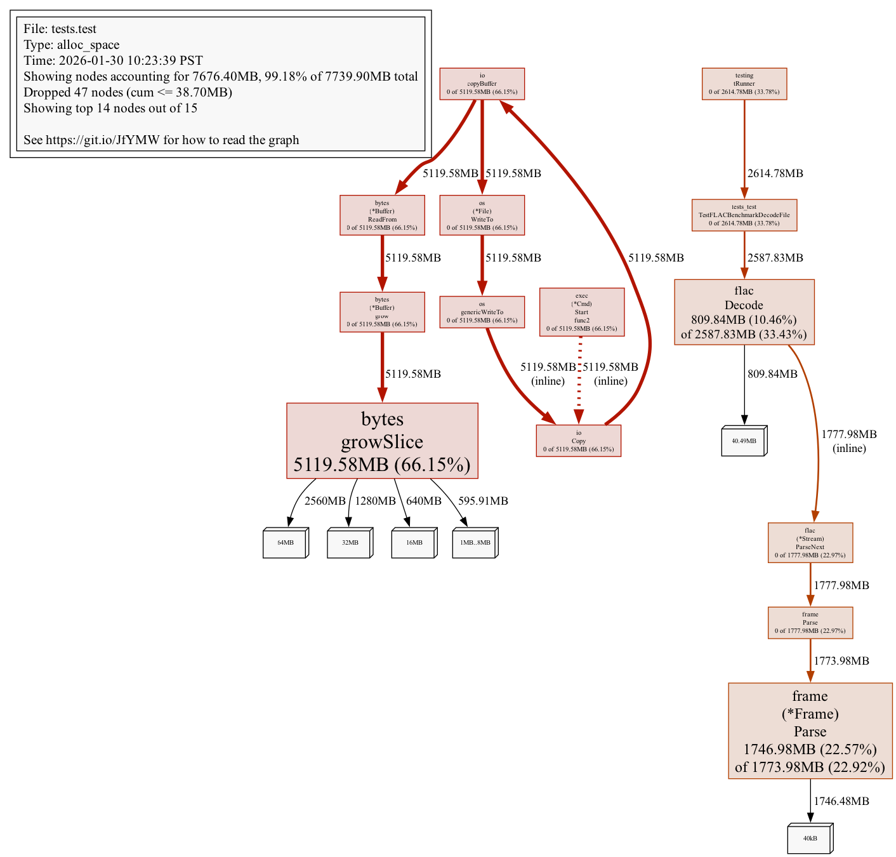

## FLAC Support Matrix

### Take away

Support is complete, except 4 bits (who needs that really).

Decoding performance has been squeezed as much as possible.
Short of doing C or chasing single digit improvements, this is probably as much as we can get in Go.

Encoder has not been optimized (still baseline upstream).

### Encoders & Decoders

| Tool        | Role            | Bit Depths Supported                    |
|-------------|-----------------|---------------------------------------- |
| saprobe     | Encode + Decode | Encode: 8, 12, 16, 20, 24, 32 / Decode: 4-32 |
| flac binary | Encode + Decode | 8, 16, 24, 32                           |
| ffmpeg      | Encode + Decode | Encode: 16, 24 / Decode: 8, 16, 24, 32 |

4-bit encoding is not supported by any encoder. The FLAC spec allows 4-bit in StreamInfo but has no frame header bit pattern for it (the "011" slot is reserved). 4-bit is excluded from the test matrix.

### Bit Depth

| Bit Depth | FLAC Spec      | saprobe encode | saprobe decode     | flac binary | ffmpeg encode | ffmpeg decode | Tests     |
|-----------|----------------|----------------|--------------------|-------------|---------------|---------------|-----------|
| 8         | Yes            | Yes            | Yes                | Yes         | No            | Yes           | 176 pass  |
| 12        | Yes            | Yes            | Yes                | No          | No            | No            | 88 pass   |
| 16        | Yes            | Yes            | Yes                | Yes         | Yes (s16)     | Yes           | 264 pass  |
| 20        | Yes            | Yes            | Yes                | No          | No            | No            | 88 pass   |
| 24        | Yes            | Yes            | Yes                | Yes         | Yes (s32)     | Yes           | 264 pass  |
| 32        | Yes (RFC 9639) | Yes            | Yes (patched fork) | Yes         | No            | Yes           | 176 pass  |

### Channels

saprobe and the flac binary produce identical output matching source PCM for all channel counts. ffmpeg applies channel layout remapping for multichannel FLAC, producing different byte ordering. These known ffmpeg multichannel disagreements are skipped in the test suite.

| Channels | saprobe | flac binary | ffmpeg decode (8-bit) | ffmpeg decode (16-bit) | ffmpeg decode (24-bit) | ffmpeg decode (32-bit) |
|----------|---------|-------------|-----------------------|------------------------|------------------------|------------------------|
| 1        | Pass    | Pass        | Pass                  | Pass                   | Pass                   | Pass                   |
| 2        | Pass    | Pass        | Pass                  | Pass                   | Pass                   | Pass                   |
| 3        | Pass    | Pass        | Skipped               | Skipped                | Skipped                | Skipped                |
| 4        | Pass    | Pass        | Skipped               | Skipped                | Skipped                | Skipped                |
| 5        | Pass    | Pass        | Pass                  | Pass                   | Skipped                | Skipped                |
| 6        | Pass    | Pass        | Pass                  | Pass                   | Skipped                | Skipped                |
| 7        | Pass    | Pass        | Pass                  | Skipped                | Skipped                | Pass                   |
| 8        | Pass    | Pass        | Pass                  | Skipped                | Skipped                | Pass                   |

### Sample Rates

All 11 tested sample rates (8000, 11025, 16000, 22050, 32000, 44100, 48000, 88200, 96000, 176400, 192000 Hz) pass for all bit depths across saprobe and flac binary decoders.

### Test Structure

Tests are organized as `TestFLACDecode/{bitDepth}/{encoder}/{sampleRate}_{channels}`.

For each encoded file, **all supported decoders** run and compare:
- Each decoder's output vs original source PCM (bit-for-bit)
- Each decoder's output vs every other decoder's output

Total: 1057 sub-tests, all passing.

ffmpeg multichannel comparisons that fail due to channel layout remapping are skipped (not counted as failures). saprobe and flac binary match source bit-for-bit in every case.

### Summary

- **Test suite:** All 1057 sub-tests pass (0 failures)
- **Encode:** 8, 12, 16, 20, 24, 32-bit
- **Decode:** 8, 12, 16, 20, 24, 32-bit (4-bit decode works but is excluded from tests since no encoder can produce it)
- **32-bit:** Requires patched mycophonic/flac fork (RFC 9639 support)
- **ffmpeg multichannel:** For certain channel counts (varies by bit depth), ffmpeg produces different PCM byte ordering due to channel layout remapping. These are skipped in tests. saprobe and flac binary match source bit-for-bit

## Decode Performance

Run `tests/bench.sh [file.flac]` to reproduce. Results below from 20 iterations decoding `tests/test.flac` (The B-52s — "Strobe Light", 4:00, 44.1kHz/16bit stereo, 27 MB FLAC).

### Timing (median)

| Tool    | Median | Mean  | Min   | Max   |
|---------|--------|-------|-------|-------|
| saprobe | 586ms  | 610ms | 583ms | 841ms |
| flac    | 290ms  | 292ms | 286ms | 318ms |
| ffmpeg  | 103ms  | 106ms | 95ms  | 125ms |

Measured without CPU profiling (`go test` only, no `-cpuprofile`). saprobe decode is ~2.0x slower than the reference C flac decoder and ~5.7x slower than ffmpeg (pure Go vs C). The dominant cost is Rice residual decoding and LPC prediction.

### CPU Profile (decode only)

Total samples: 12.82s across 20 decode iterations.

| Function                              | Flat    | Flat%  | Cum      | Cum%   |
|---------------------------------------|---------|--------|----------|--------|
| frame.(*Subframe).decodeLPC           | 1710ms  | 13.34% | 1780ms   | 13.88% |
| bits.(*Reader).Read                   | 1640ms  | 12.79% | 2220ms   | 17.32% |
| flac.interleave                       | 1560ms  | 12.17% | 1560ms   | 12.17% |
| bits.(*Reader).ReadUnary              | 710ms   | 5.54%  | 950ms    | 7.41%  |
| runtime.memclrNoHeapPointers          | 570ms   | 4.45%  | 570ms    | 4.45%  |
| frame.(*Subframe).decodeRicePart      | 530ms   | 4.13%  | 4210ms   | 32.84% |
| frame.(*Subframe).decodeRiceResidual  | 520ms   | 4.06%  | 3670ms   | 28.63% |
| crc16.Update                          | 290ms   | 2.26%  | 290ms    | 2.26%  |
| frame.(*Frame).parseSubframe          | 250ms   | 1.95%  | 6280ms   | 48.99% |
| bits.(*Reader).consumeBytes           | 240ms   | 1.87%  | 530ms    | 4.13%  |

The I/O chain is a single buffered struct (`bits.Reader` with 4KB buffer and inline CRC). `ReadUnary` uses byte-at-a-time leading-zero-count via `math/bits.LeadingZeros8` instead of bit-at-a-time scanning. Sample buffers are allocated as one contiguous `[]int32` per frame (all channels), eliminating per-subframe allocations. The hot path is Rice residual decoding (32.84% cum via `decodeRicePart`) through `bits.Reader.Read` (17.32% cum) + `bits.Reader.ReadUnary` (7.41% cum). LPC prediction (`decodeLPC`) is 13.88% cum — the single largest flat contributor. PCM interleaving is 12.17% flat.

### Memory Profile (alloc_space, decode only)

Total allocated: 7.80 GB across all decode iterations.

| Function                         | Flat      | Flat%  | Cum       | Cum%   |
|----------------------------------|-----------|--------|-----------|--------|
| bytes.growSlice                  | 5117 MB   | 65.59% | 5117 MB   | 65.59% |
| frame.(*Frame).Parse             | 1810 MB   | 23.20% | 1837 MB   | 23.55% |
| flac.Decode                      | 810 MB    | 10.38% | 2650 MB   | 33.97% |

`bytes.growSlice` (66%) is from subprocess I/O (flac/ffmpeg binary output capture), not saprobe decode. The saprobe decode allocations are: `Frame.Parse` (1810 MB — one contiguous `[]int32` per frame for all channels, eliminating per-subframe allocations) and `flac.Decode` (810 MB — output buffer assembly). `parseSubframe` no longer appears as an allocation source.

### Call Graphs

Generated by `tests/bench.sh` via `go tool pprof`.

#### CPU — hot path through the decode I/O chain

#### Memory (alloc_space) — allocation sources across decode iterations

